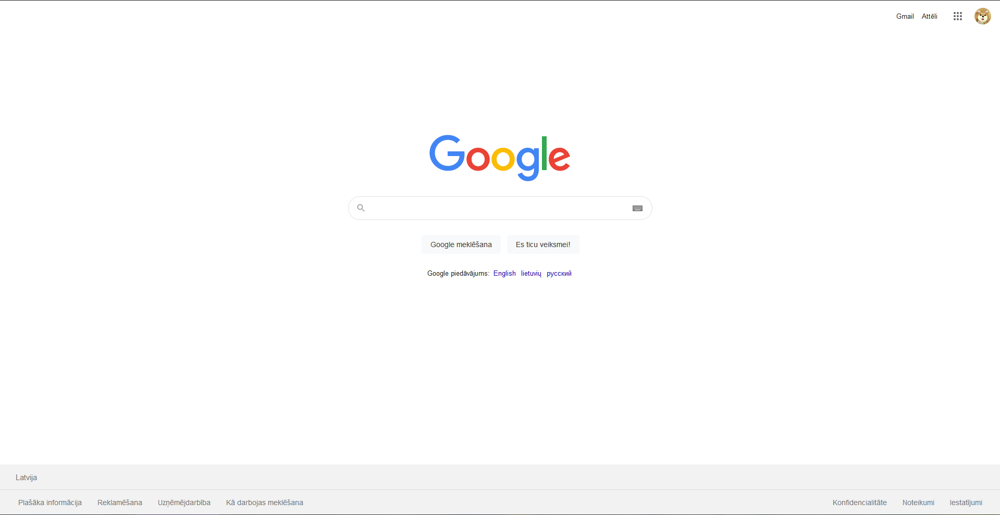

# google clone HTML

## Kas tika veidots?

Uzdevums bija izveidot 2 lapas HTML valodā, kuras izskatās pēc iespējas līdzīgāk oriģinālam `google.com` un google search lapu kur tiek meklēts `RVT` skolas mājaslapa.

## Kur un kā tika veikts darbs?

Darbs tika veikts `VSC (Visual Studio Code)` programmā, kuru es šī procesa laikā mēģināju nokonfigurēt tā lai man ir vieglāk strādāt ar kodiem.

## Materiālu meklēšana

Materiālu, kā ikonas vai bildes priekš `Google clone` tikas meklētas internetā visādās mājaslapās kas dod tādu iespēju meklēt un lādēt iconas.

Palīdzības materiālus, lai saprastu kā varu HTML valodā izdarīt konkrēu lietu viss biežāk tika maklēts https://www.w3schools.com/ vai https://stackoverflow.com/. Šīs 2 mājas lapās viss labāk par problēmu vai jautājumu kas ir nesaprotams.

## Manu lapu salīdzināšana ar oriģinālo Google lapu

**Oriģinālā google lapa.**

---

**Mana google lapa**

# Kā man patika šis darbs

Man šitas darbs ļoti patika, iemācijos HTML pamatus, kā arī ļoti patika mans rezūltāts ko es sasniedzu pa šo nedēļu. Varbūt nav baigi kvalatatīvi uztaisīts, bet es ļoti centos šo darbu uztaisīt iespējas labāk!